# BDD100K Dataset Analysis Report

Filtered to categories: car, bus, person, truck, bike

## Overview

| Split | Images on disk | Annotated images | Total objects (filtered) |
|---|---|---|---|
| train | 70000 | 69863 | 853413 |
| val | 10000 | 10000 | 122617 |
| test | 20000 | 0 | 0 |

## TRAIN split

### Image resolutions (sampled)

| Resolution (W x H) | Count |
|---|---|
| 1280 x 720 | 500 |

File size (KB, sampled): min=24.9, max=115.0, mean=55.8, median=55.3

### Object class distribution (filtered)

| Category | Count | % of filtered objects |
|---|---|---|
| car | 713211 | 83.57% |
| person | 91349 | 10.70% |
| truck | 29971 | 3.51% |
| bus | 11672 | 1.37% |
| bike | 7210 | 0.84% |

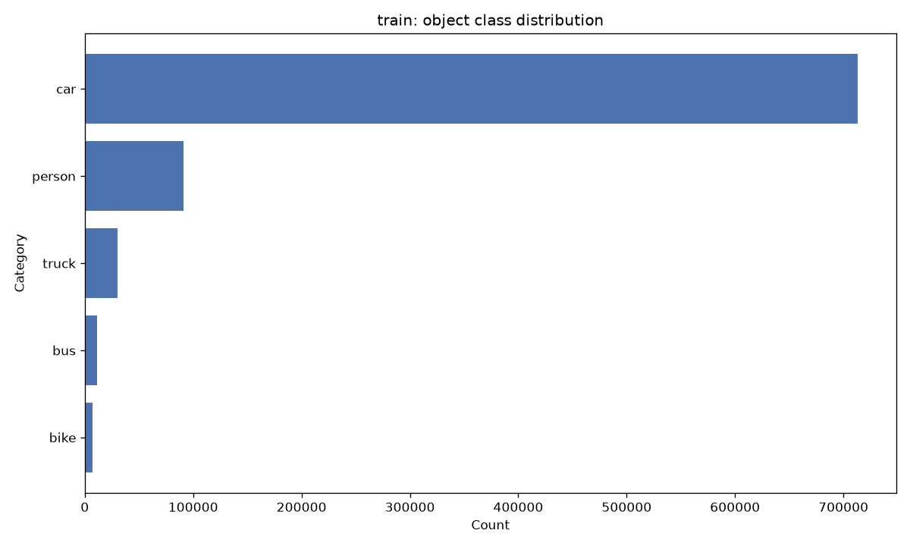

### Weather distribution

| Weather | Count |
|---|---|
| clear | 37344 |
| overcast | 8770 |
| undefined | 8119 |
| snowy | 5549 |
| rainy | 5070 |
| partly cloudy | 4881 |
| foggy | 130 |

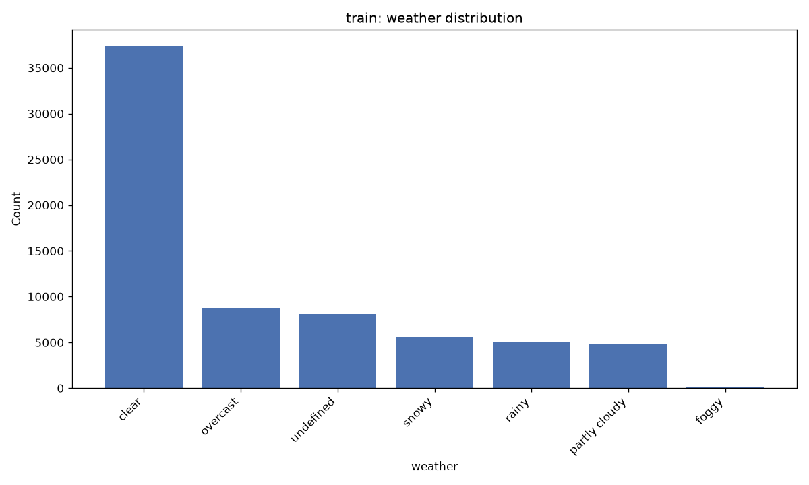

### Scene distribution

| Scene | Count |
|---|---|
| city street | 43516 |
| highway | 17379 |
| residential | 8074 |
| parking lot | 377 |
| undefined | 361 |
| tunnel | 129 |
| gas stations | 27 |

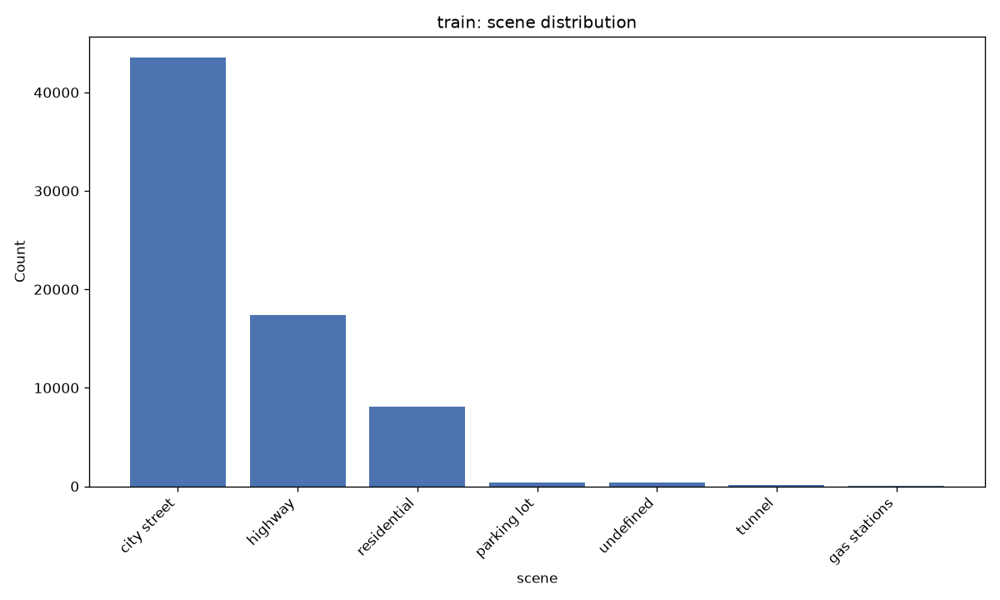

### Time of day distribution

| Time of day | Count |
|---|---|
| daytime | 36728 |
| night | 27971 |
| dawn/dusk | 5027 |
| undefined | 137 |

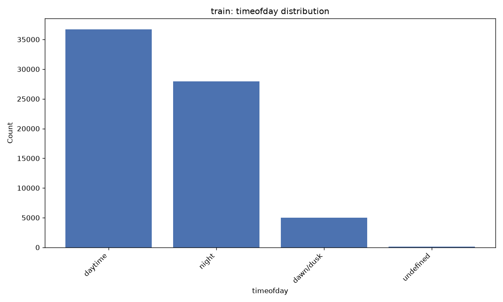

### Occlusion / truncation (filtered categories)

Occluded: {False: 283974, True: 569439}

Truncated: {False: 776384, True: 77029}

### Bounding box size analysis by category

| Category | N | Median W | Mean W | Median H | Mean H | Median Area | Mean Area |
|---|---|---|---|---|---|---|---|
| car | 713211 | 41.5 | 74.6 | 33.8 | 58.0 | 1382 | 9422 |
| bus | 11672 | 92.3 | 145.7 | 70.4 | 127.4 | 6337 | 35807 |
| person | 91349 | 21.2 | 27.7 | 51.9 | 66.7 | 1076 | 2945 |
| truck | 29971 | 82.4 | 127.6 | 67.8 | 115.1 | 5594 | 27771 |
| bike | 7210 | 47.4 | 60.6 | 52.2 | 67.4 | 2460 | 5925 |

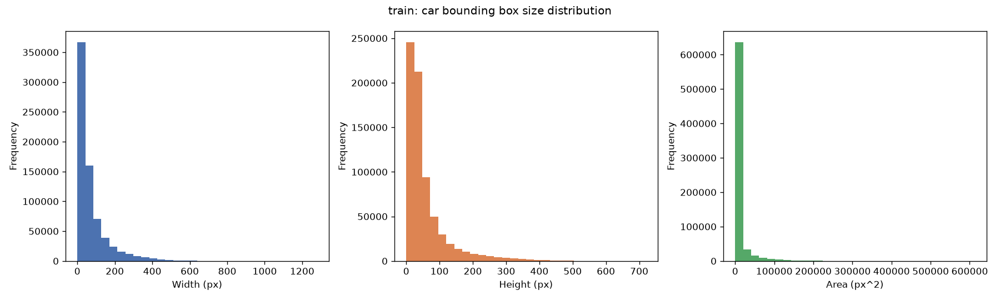

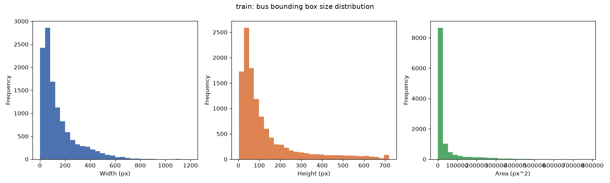

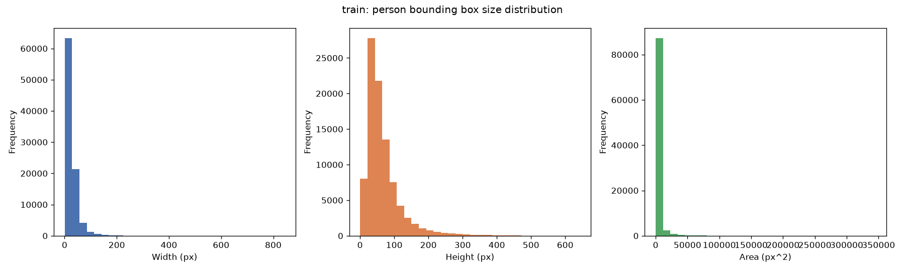

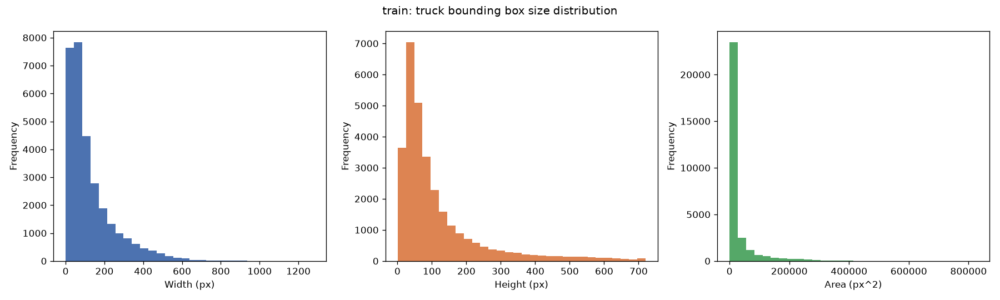

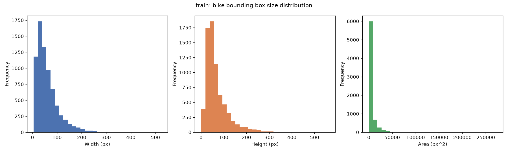

## VAL split

### Image resolutions (sampled)

| Resolution (W x H) | Count |
|---|---|
| 1280 x 720 | 500 |

File size (KB, sampled): min=22.7, max=107.1, mean=56.1, median=54.4

### Object class distribution (filtered)

| Category | Count | % of filtered objects |
|---|---|---|
| car | 102506 | 83.60% |
| person | 13262 | 10.82% |
| truck | 4245 | 3.46% |
| bus | 1597 | 1.30% |
| bike | 1007 | 0.82% |

### Weather distribution

| Weather | Count |
|---|---|
| clear | 5346 |
| overcast | 1239 |
| undefined | 1157 |
| snowy | 769 |
| rainy | 738 |
| partly cloudy | 738 |
| foggy | 13 |

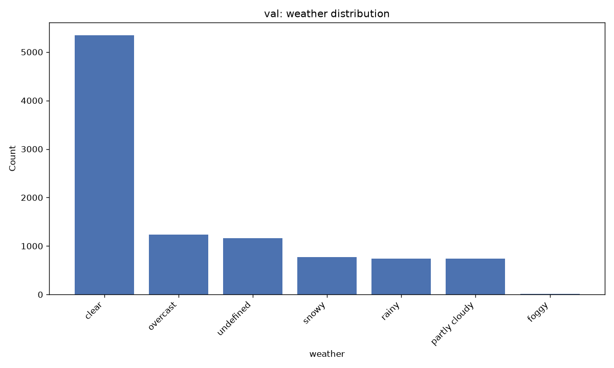

### Scene distribution

| Scene | Count |
|---|---|
| city street | 6112 |
| highway | 2499 |
| residential | 1253 |
| undefined | 53 |
| parking lot | 49 |
| tunnel | 27 |
| gas stations | 7 |

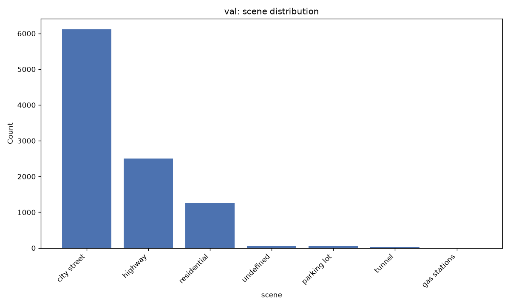

### Time of day distribution

| Time of day | Count |
|---|---|
| daytime | 5258 |
| night | 3929 |
| dawn/dusk | 778 |
| undefined | 35 |

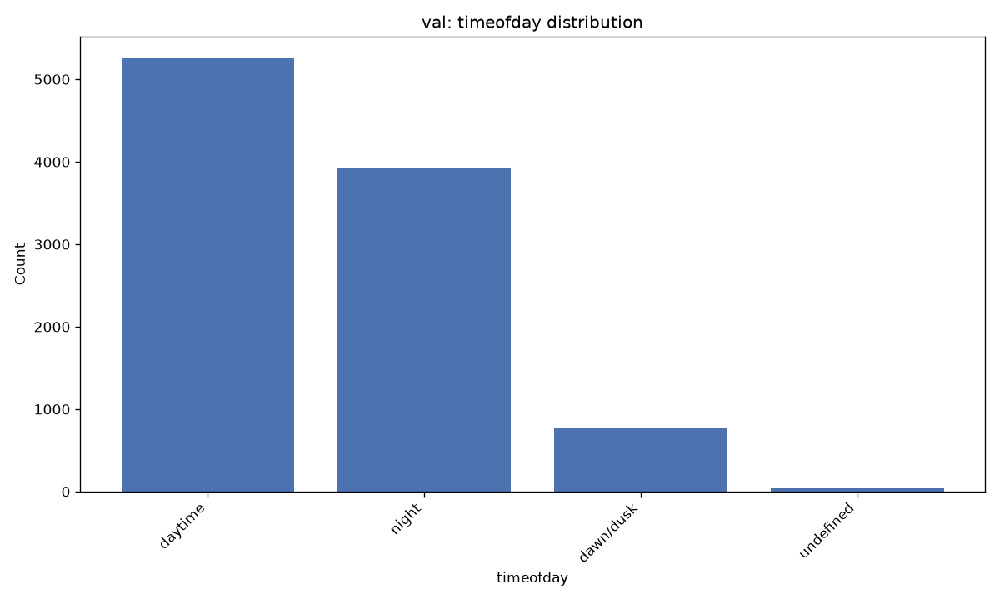

### Occlusion / truncation (filtered categories)

Occluded: {True: 81801, False: 40816}

Truncated: {False: 111680, True: 10937}

### Bounding box size analysis by category

| Category | N | Median W | Mean W | Median H | Mean H | Median Area | Mean Area |
|---|---|---|---|---|---|---|---|
| car | 102506 | 41.2 | 74.3 | 33.8 | 57.9 | 1366 | 9389 |
| bus | 1597 | 92.1 | 143.4 | 68.6 | 123.5 | 5947 | 33675 |
| person | 13262 | 21.2 | 27.5 | 52.0 | 66.0 | 1083 | 2880 |
| truck | 4245 | 81.1 | 125.4 | 68.2 | 113.9 | 5511 | 27423 |
| bike | 1007 | 46.3 | 59.0 | 52.4 | 65.0 | 2447 | 5413 |

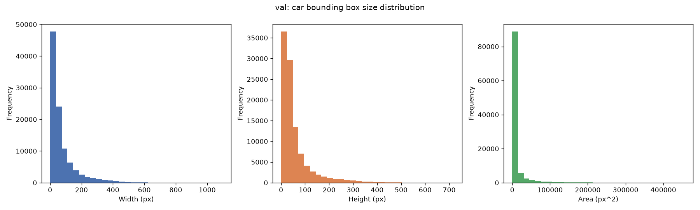

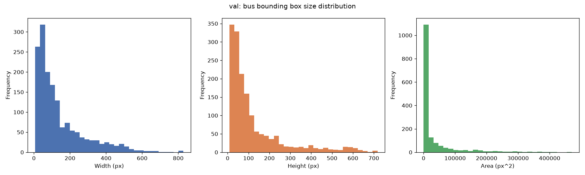

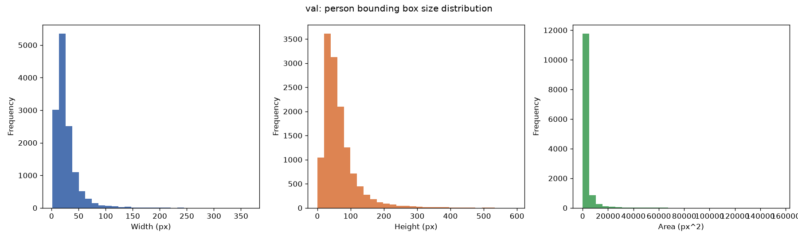

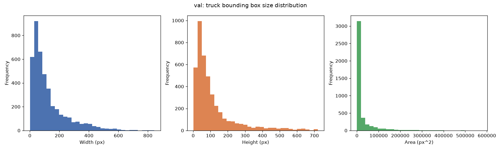

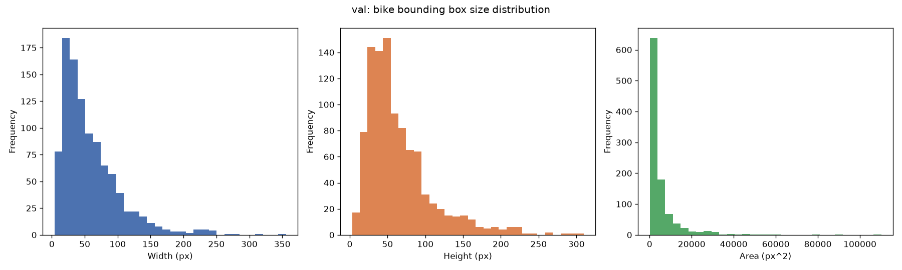

## TEST split

### Image resolutions (sampled)

| Resolution (W x H) | Count |
|---|---|
| 1280 x 720 | 500 |

File size (KB, sampled): min=22.3, max=123.4, mean=57.9, median=57.2
