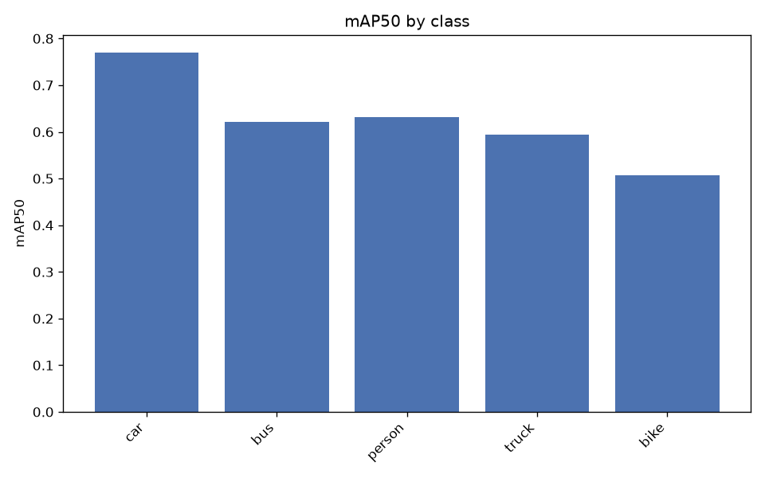
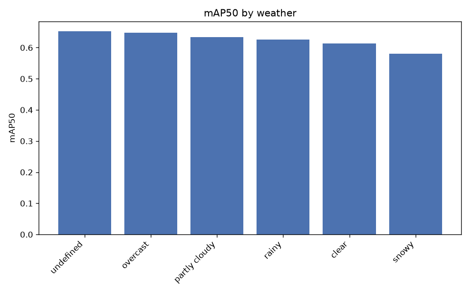
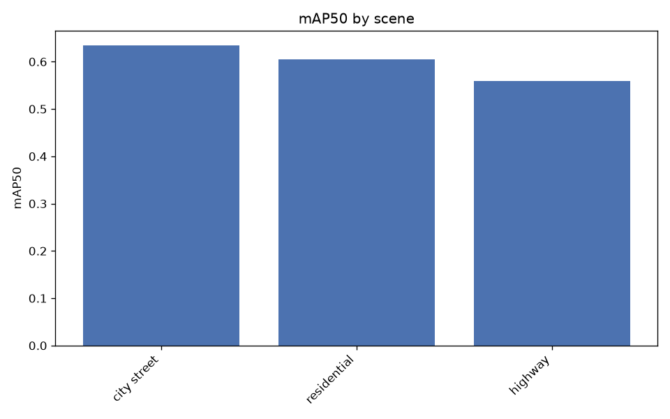
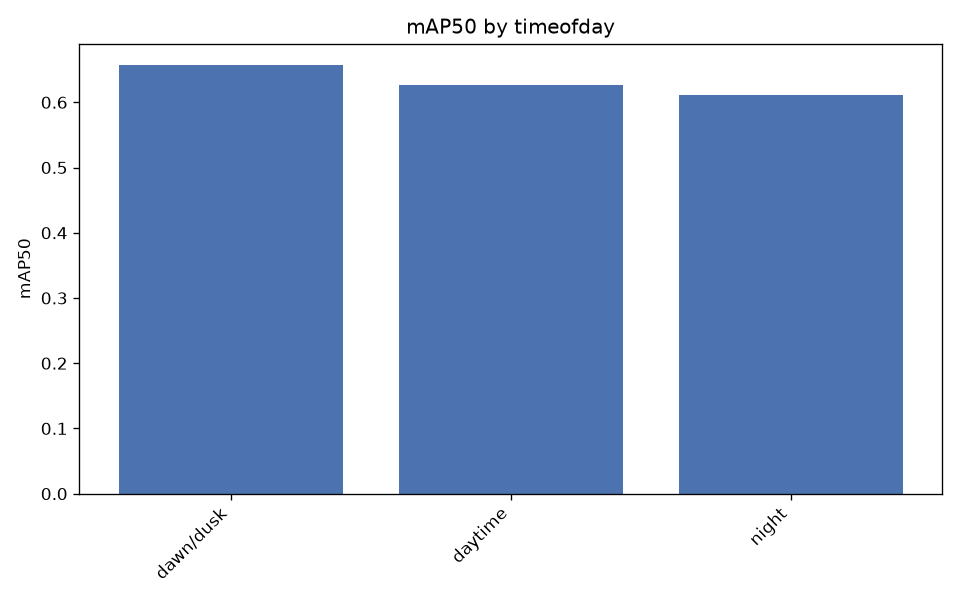
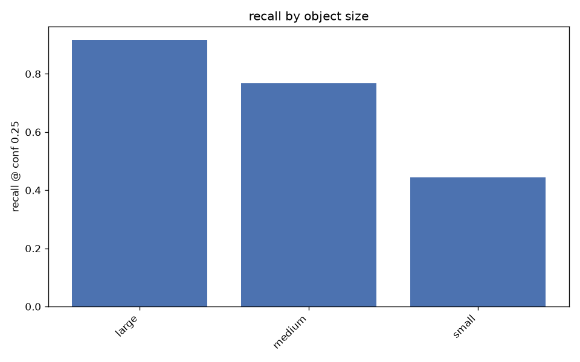

# Evaluation report

Experiment: `yolo11s-p2_640_bdd5_10k` | imgsz 640 | val images 2000
Slice metrics below the mAP tables are recall at conf 0.25, IoU 0.5.

## Overall

- mAP50: 0.6245
- mAP50-95: 0.3798
- precision: 0.6821
- recall: 0.5548

## Per class

| class   |   precision |   recall |   mAP50 |   mAP50-95 |
|:--------|------------:|---------:|--------:|-----------:|
| car     |      0.7897 |   0.6840 |  0.7696 |     0.4755 |
| bus     |      0.6363 |   0.5615 |  0.6211 |     0.4607 |
| person  |      0.7349 |   0.5326 |  0.6316 |     0.3037 |
| truck   |      0.6404 |   0.5384 |  0.5934 |     0.4121 |
| bike    |      0.6094 |   0.4573 |  0.5065 |     0.2471 |

## By weather

| weather       |   n_images |   precision |   recall |   mAP50 |   mAP50-95 |
|:--------------|-----------:|------------:|---------:|--------:|-----------:|
| undefined     |        327 |      0.7206 |   0.5764 |  0.6519 |     0.4103 |
| overcast      |        287 |      0.7232 |   0.5447 |  0.6476 |     0.3907 |
| partly cloudy |        177 |      0.7196 |   0.5231 |  0.6339 |     0.3902 |
| rainy         |        146 |      0.6685 |   0.5685 |  0.6261 |     0.3753 |
| clear         |        893 |      0.6782 |   0.5478 |  0.6130 |     0.3748 |
| snowy         |        167 |      0.6246 |   0.5582 |  0.5811 |     0.3365 |

## By scene

| scene       |   n_images |   precision |   recall |   mAP50 |   mAP50-95 |
|:------------|-----------:|------------:|---------:|--------:|-----------:|
| city street |       1475 |      0.6884 |   0.5656 |  0.6343 |     0.3896 |
| residential |        188 |      0.6618 |   0.5319 |  0.6045 |     0.3685 |
| highway     |        330 |      0.6478 |   0.5071 |  0.5587 |     0.3204 |

## By timeofday

| timeofday   |   n_images |   precision |   recall |   mAP50 |   mAP50-95 |
|:------------|-----------:|------------:|---------:|--------:|-----------:|
| dawn/dusk   |        173 |      0.7285 |   0.5785 |  0.6571 |     0.4066 |
| daytime     |       1351 |      0.6843 |   0.5561 |  0.6265 |     0.3822 |
| night       |        472 |      0.6700 |   0.5493 |  0.6107 |     0.3657 |

## By object size

Buckets are COCO convention on box area: small <32^2, medium 32^2-96^2, large >96^2 px.

| class   | size   |   n_gt |   recall |
|:--------|:-------|-------:|---------:|
| ALL     | large  |   5279 |   0.9176 |
| ALL     | medium |  12722 |   0.7676 |
| ALL     | small  |  13279 |   0.4439 |
| car     | small  |   9256 |   0.4932 |
| car     | medium |   7977 |   0.8290 |
| car     | large  |   3854 |   0.9660 |
| bus     | small  |    148 |   0.1419 |
| bus     | medium |    389 |   0.5167 |
| bus     | large  |    357 |   0.7815 |
| person  | small  |   3343 |   0.3652 |
| person  | medium |   3082 |   0.7391 |
| person  | large  |    295 |   0.8508 |
| truck   | small  |    300 |   0.1467 |
| truck   | medium |    727 |   0.5021 |
| truck   | large  |    641 |   0.7551 |
| bike    | small  |    232 |   0.1897 |
| bike    | medium |    547 |   0.5649 |
| bike    | large  |    132 |   0.8106 |

## By occlusion / truncation

| group     | class   |   n_gt |   recall |
|:----------|:--------|-------:|---------:|
| occluded  | bike    |    801 |   0.5019 |
| occluded  | bus     |    603 |   0.4627 |
| occluded  | car     |  14683 |   0.6186 |
| occluded  | person  |   4121 |   0.4482 |
| occluded  | truck   |   1120 |   0.4509 |
| truncated | bike    |     73 |   0.6027 |
| truncated | bus     |    145 |   0.7448 |
| truncated | car     |   1952 |   0.8555 |
| truncated | person  |    210 |   0.6524 |
| truncated | truck   |    245 |   0.6898 |
| visible   | bike    |    110 |   0.5273 |
| visible   | bus     |    291 |   0.7629 |
| visible   | car     |   6404 |   0.9085 |
| visible   | person  |   2599 |   0.7322 |
| visible   | truck   |    548 |   0.7080 |
| whole     | bike    |    838 |   0.4964 |
| whole     | bus     |    749 |   0.5247 |
| whole     | car     |  19135 |   0.6915 |
| whole     | person  |   6510 |   0.5550 |
| whole     | truck   |   1423 |   0.5088 |

## False positive types

| fp_type         |   count |
|:----------------|--------:|
| localization    |    3689 |
| duplicate       |    1741 |
| background      |    1376 |
| class_confusion |    1001 |

Most common class confusions:

| gt     | predicted   |   count |
|:-------|:------------|--------:|
| truck  | car         |     305 |
| car    | truck       |     185 |
| truck  | bus         |     149 |
| bus    | truck       |     125 |
| bus    | car         |     104 |
| car    | bus         |      53 |
| person | bike        |      24 |
| bike   | person      |      17 |
| person | car         |      15 |
| car    | person      |      12 |

## Worst images

| image                 |   n_gt |   fn |   fp |   errors | timeofday   | weather       |
|:----------------------|-------:|-----:|-----:|---------:|:------------|:--------------|
| b792daf1-e95167d2.jpg |     52 |   27 |   16 |       43 | dawn/dusk   | clear         |
| b41d35f8-6cf85033.jpg |     45 |   29 |    9 |       38 | daytime     | clear         |
| b4c733a8-46d78670.jpg |     41 |   25 |   13 |       38 | daytime     | partly cloudy |
| bea82122-66fc59a4.jpg |     49 |   27 |   10 |       37 | daytime     | clear         |
| c99a4baf-a0146015.jpg |     36 |   28 |    8 |       36 | daytime     | partly cloudy |
| b4065fc4-ede06556.jpg |     46 |   18 |   16 |       34 | daytime     | clear         |
| be1a0aee-7127f0d8.jpg |     32 |   26 |    8 |       34 | daytime     | snowy         |
| c28cecbb-11796cf6.jpg |     39 |   28 |    6 |       34 | daytime     | overcast      |
| b2daf29d-6198754f.jpg |     47 |   25 |    8 |       33 | daytime     | overcast      |
| b4542860-0b880bb4.jpg |     47 |   19 |   13 |       32 | daytime     | clear         |
| b49d6c0d-bb90cc08.jpg |     39 |   13 |   18 |       31 | daytime     | undefined     |
| c31625c9-9e5a7d0c.jpg |     40 |   20 |   11 |       31 | daytime     | overcast      |

Overlays in `failures/` — green = correct, red = false positive, yellow = missed.

Curves and confusion matrix: `overall/`