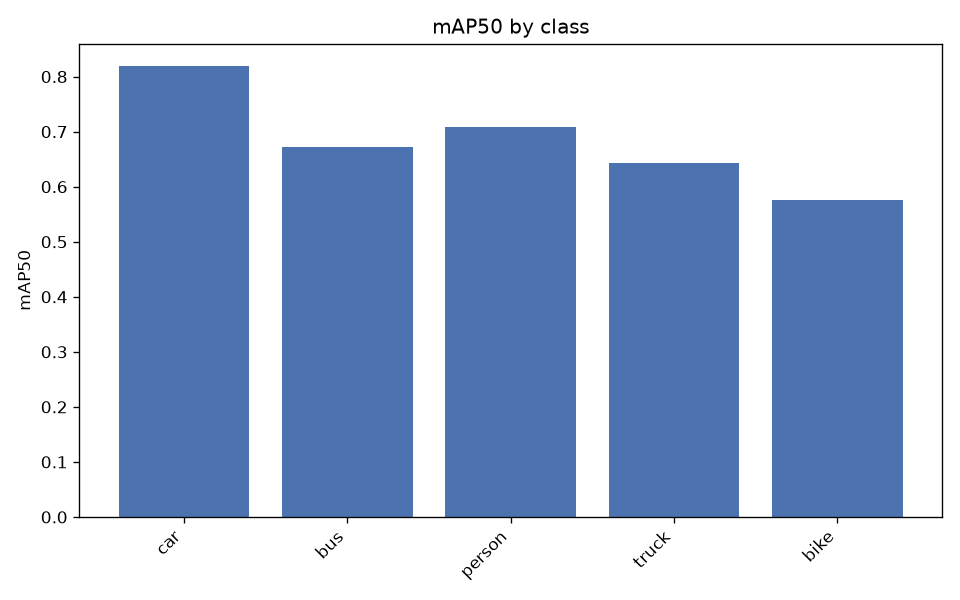
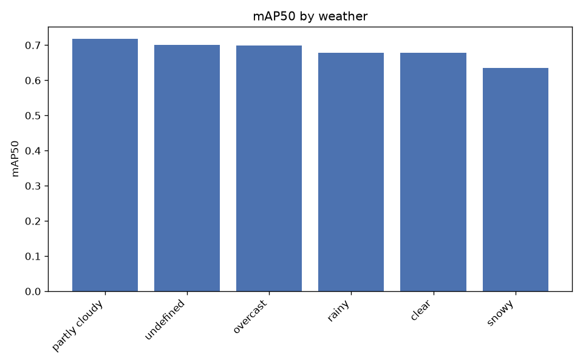
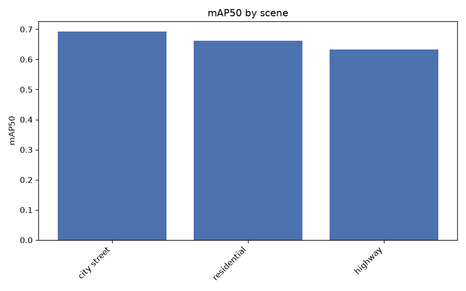
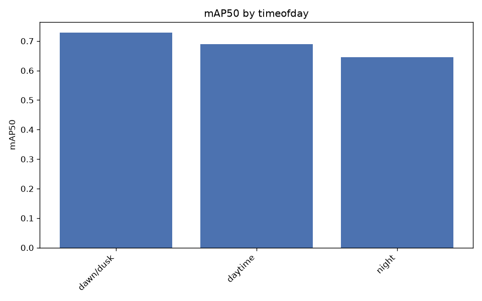
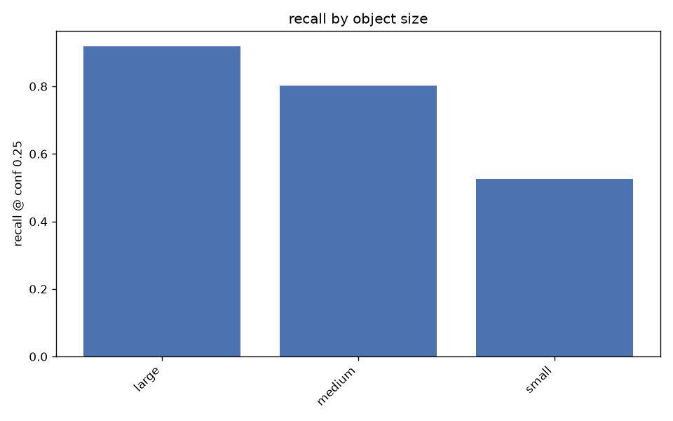

# Evaluation report

Experiment: `yolo11s_1280_bdd5_10k` | imgsz 1280 | val images 2000
Slice metrics below the mAP tables are recall at conf 0.25, IoU 0.5.

## Overall

- mAP50: 0.6837
- mAP50-95: 0.4270
- precision: 0.7364
- recall: 0.6022

## Per class

| class   |   precision |   recall |   mAP50 |   mAP50-95 |
|:--------|------------:|---------:|--------:|-----------:|
| car     |      0.8364 |   0.7276 |  0.8190 |     0.5164 |
| bus     |      0.6727 |   0.6119 |  0.6728 |     0.5071 |
| person  |      0.7951 |   0.5902 |  0.7080 |     0.3630 |
| truck   |      0.6665 |   0.5797 |  0.6425 |     0.4549 |
| bike    |      0.7114 |   0.5016 |  0.5763 |     0.2934 |

## By weather

| weather       |   n_images |   precision |   recall |   mAP50 |   mAP50-95 |
|:--------------|-----------:|------------:|---------:|--------:|-----------:|
| partly cloudy |        177 |      0.7926 |   0.6038 |  0.7172 |     0.4547 |
| undefined     |        327 |      0.7482 |   0.6210 |  0.7005 |     0.4507 |
| overcast      |        287 |      0.7557 |   0.6179 |  0.6992 |     0.4337 |
| rainy         |        146 |      0.7557 |   0.5809 |  0.6785 |     0.4287 |
| clear         |        893 |      0.7265 |   0.5982 |  0.6774 |     0.4227 |
| snowy         |        167 |      0.6684 |   0.5869 |  0.6357 |     0.3793 |

## By scene

| scene       |   n_images |   precision |   recall |   mAP50 |   mAP50-95 |
|:------------|-----------:|------------:|---------:|--------:|-----------:|
| city street |       1475 |      0.7467 |   0.6067 |  0.6923 |     0.4356 |
| residential |        188 |      0.7174 |   0.5695 |  0.6619 |     0.4105 |
| highway     |        330 |      0.7254 |   0.5514 |  0.6335 |     0.3798 |

## By timeofday

| timeofday   |   n_images |   precision |   recall |   mAP50 |   mAP50-95 |
|:------------|-----------:|------------:|---------:|--------:|-----------:|
| dawn/dusk   |        173 |      0.7827 |   0.6191 |  0.7284 |     0.4612 |
| daytime     |       1351 |      0.7494 |   0.6048 |  0.6890 |     0.4320 |
| night       |        472 |      0.6928 |   0.5768 |  0.6460 |     0.3966 |

## By object size

Buckets are COCO convention on box area: small <32^2, medium 32^2-96^2, large >96^2 px.

| class   | size   |   n_gt |   recall |
|:--------|:-------|-------:|---------:|
| ALL     | large  |   5279 |   0.9191 |
| ALL     | medium |  12722 |   0.8018 |
| ALL     | small  |  13279 |   0.5263 |
| car     | small  |   9256 |   0.5711 |
| car     | medium |   7977 |   0.8525 |
| car     | large  |   3854 |   0.9652 |
| bus     | small  |    148 |   0.2230 |
| bus     | medium |    389 |   0.6093 |
| bus     | large  |    357 |   0.8263 |
| person  | small  |   3343 |   0.4535 |
| person  | medium |   3082 |   0.7910 |
| person  | large  |    295 |   0.8678 |
| truck   | small  |    300 |   0.2833 |
| truck   | medium |    727 |   0.5557 |
| truck   | large  |    641 |   0.7426 |
| bike    | small  |    232 |   0.2974 |
| bike    | medium |    547 |   0.5887 |
| bike    | large  |    132 |   0.7955 |

## By occlusion / truncation

| group     | class   |   n_gt |   recall |
|:----------|:--------|-------:|---------:|
| occluded  | bike    |    801 |   0.5431 |
| occluded  | bus     |    603 |   0.5456 |
| occluded  | car     |  14683 |   0.6749 |
| occluded  | person  |   4121 |   0.5217 |
| occluded  | truck   |   1120 |   0.5170 |
| truncated | bike    |     73 |   0.6027 |
| truncated | bus     |    145 |   0.7655 |
| truncated | car     |   1952 |   0.8668 |
| truncated | person  |    210 |   0.7143 |
| truncated | truck   |    245 |   0.6449 |
| visible   | bike    |    110 |   0.5545 |
| visible   | bus     |    291 |   0.8110 |
| visible   | car     |   6404 |   0.9207 |
| visible   | person  |   2599 |   0.7926 |
| visible   | truck   |    548 |   0.7044 |
| whole     | bike    |    838 |   0.5394 |
| whole     | bus     |    749 |   0.6061 |
| whole     | car     |  19135 |   0.7376 |
| whole     | person  |   6510 |   0.6237 |
| whole     | truck   |   1423 |   0.5671 |

## False positive types

| fp_type         |   count |
|:----------------|--------:|
| localization    |    3210 |
| background      |    1344 |
| duplicate       |    1145 |
| class_confusion |     944 |

Most common class confusions:

| gt     | predicted   |   count |
|:-------|:------------|--------:|
| truck  | car         |     272 |
| car    | truck       |     194 |
| truck  | bus         |     146 |
| bus    | truck       |     114 |
| bus    | car         |      77 |
| car    | bus         |      74 |
| car    | person      |      15 |
| person | car         |      14 |
| bike   | person      |      14 |
| person | bike        |      13 |

## Worst images

| image                 |   n_gt |   fn |   fp |   errors | timeofday   | weather       |
|:----------------------|-------:|-----:|-----:|---------:|:------------|:--------------|
| b4c733a8-46d78670.jpg |     41 |   25 |   13 |       38 | daytime     | partly cloudy |
| b792daf1-e95167d2.jpg |     52 |   27 |   11 |       38 | dawn/dusk   | clear         |
| be1a0aee-7127f0d8.jpg |     32 |   22 |   16 |       38 | daytime     | snowy         |
| b41d35f8-6cf85033.jpg |     45 |   28 |    4 |       32 | daytime     | clear         |
| c99a4baf-a0146015.jpg |     36 |   23 |    9 |       32 | daytime     | partly cloudy |
| b2daf29d-6198754f.jpg |     47 |   25 |    6 |       31 | daytime     | overcast      |
| b49d6c0d-bb90cc08.jpg |     39 |   13 |   18 |       31 | daytime     | undefined     |
| c28cecbb-11796cf6.jpg |     39 |   27 |    4 |       31 | daytime     | overcast      |
| bc7a0adc-260a111d.jpg |     35 |   19 |   11 |       30 | daytime     | partly cloudy |
| bea82122-66fc59a4.jpg |     49 |   22 |    8 |       30 | daytime     | clear         |
| c51ec845-99c75a49.jpg |     41 |   24 |    5 |       29 | daytime     | partly cloudy |
| bab90acb-5e9f3a31.jpg |     40 |   19 |    8 |       27 | night       | clear         |

Overlays in `failures/` — green = correct, red = false positive, yellow = missed.

Curves and confusion matrix: `overall/`