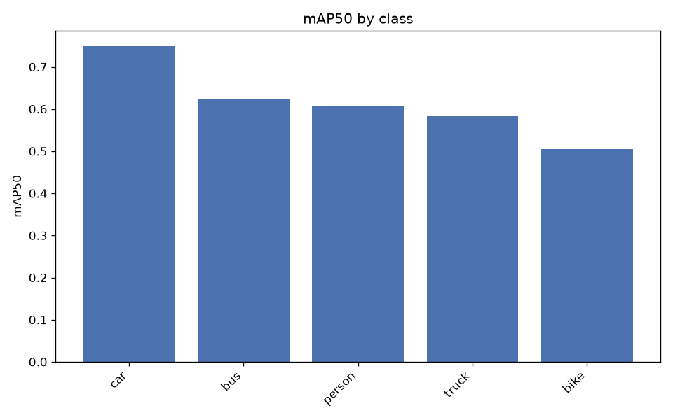
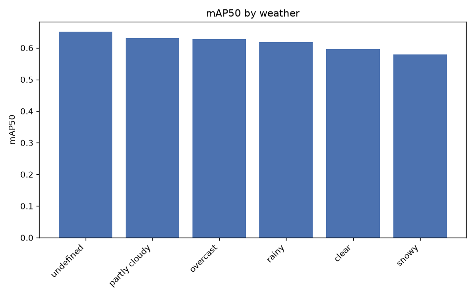
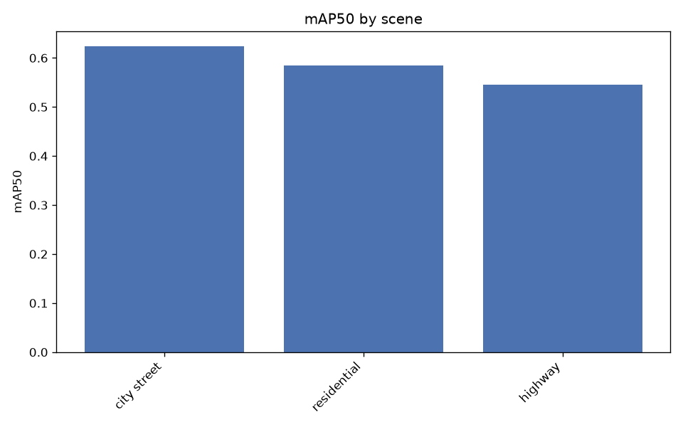
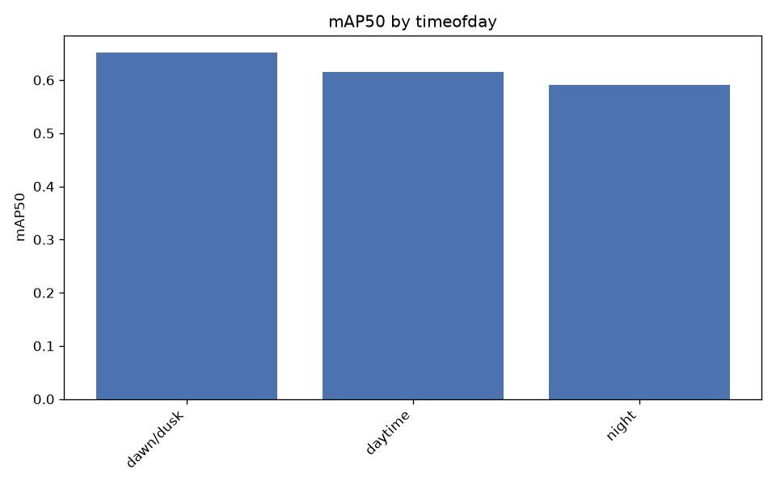
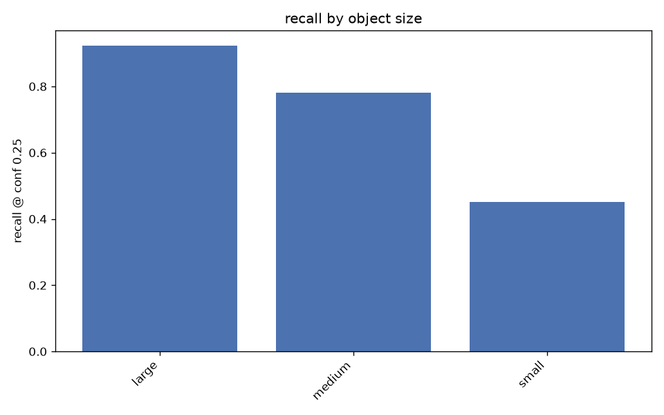

# Evaluation report

Experiment: `yolo11s_640_bdd5_10k` | imgsz 640 | val images 2000
Slice metrics below the mAP tables are recall at conf 0.25, IoU 0.5.

## Overall

- mAP50: 0.6134
- mAP50-95: 0.3747
- precision: 0.6902
- recall: 0.5540

## Per class

| class   |   precision |   recall |   mAP50 |   mAP50-95 |
|:--------|------------:|---------:|--------:|-----------:|
| car     |      0.7739 |   0.6883 |  0.7489 |     0.4597 |
| bus     |      0.6723 |   0.5600 |  0.6224 |     0.4642 |
| person  |      0.7385 |   0.5189 |  0.6082 |     0.2903 |
| truck   |      0.6372 |   0.5317 |  0.5832 |     0.4082 |
| bike    |      0.6292 |   0.4709 |  0.5045 |     0.2509 |

## By weather

| weather       |   n_images |   precision |   recall |   mAP50 |   mAP50-95 |
|:--------------|-----------:|------------:|---------:|--------:|-----------:|
| undefined     |        327 |      0.7008 |   0.5989 |  0.6506 |     0.4139 |
| partly cloudy |        177 |      0.7034 |   0.5650 |  0.6315 |     0.3858 |
| overcast      |        287 |      0.7170 |   0.5522 |  0.6271 |     0.3789 |
| rainy         |        146 |      0.7055 |   0.5531 |  0.6178 |     0.3752 |
| clear         |        893 |      0.6771 |   0.5361 |  0.5965 |     0.3659 |
| snowy         |        167 |      0.6613 |   0.5160 |  0.5790 |     0.3356 |

## By scene

| scene       |   n_images |   precision |   recall |   mAP50 |   mAP50-95 |
|:------------|-----------:|------------:|---------:|--------:|-----------:|
| city street |       1475 |      0.6968 |   0.5610 |  0.6237 |     0.3838 |
| residential |        188 |      0.6997 |   0.5305 |  0.5847 |     0.3651 |
| highway     |        330 |      0.6389 |   0.5142 |  0.5456 |     0.3167 |

## By timeofday

| timeofday   |   n_images |   precision |   recall |   mAP50 |   mAP50-95 |
|:------------|-----------:|------------:|---------:|--------:|-----------:|
| dawn/dusk   |        173 |      0.6920 |   0.6101 |  0.6517 |     0.3942 |
| daytime     |       1351 |      0.6958 |   0.5561 |  0.6159 |     0.3778 |
| night       |        472 |      0.6660 |   0.5276 |  0.5916 |     0.3580 |

## By object size

Buckets are COCO convention on box area: small <32^2, medium 32^2-96^2, large >96^2 px.

| class   | size   |   n_gt |   recall |
|:--------|:-------|-------:|---------:|
| ALL     | large  |   5279 |   0.9237 |
| ALL     | medium |  12722 |   0.7812 |
| ALL     | small  |  13279 |   0.4515 |
| car     | small  |   9256 |   0.5075 |
| car     | medium |   7977 |   0.8410 |
| car     | large  |   3854 |   0.9660 |
| bus     | small  |    148 |   0.0878 |
| bus     | medium |    389 |   0.5553 |
| bus     | large  |    357 |   0.8067 |
| person  | small  |   3343 |   0.3590 |
| person  | medium |   3082 |   0.7521 |
| person  | large  |    295 |   0.8712 |
| truck   | small  |    300 |   0.1467 |
| truck   | medium |    727 |   0.5131 |
| truck   | large  |    641 |   0.7769 |
| bike    | small  |    232 |   0.1810 |
| bike    | medium |    547 |   0.5887 |
| bike    | large  |    132 |   0.8333 |

## By occlusion / truncation

| group     | class   |   n_gt |   recall |
|:----------|:--------|-------:|---------:|
| occluded  | bike    |    801 |   0.5156 |
| occluded  | bus     |    603 |   0.4809 |
| occluded  | car     |  14683 |   0.6331 |
| occluded  | person  |   4121 |   0.4516 |
| occluded  | truck   |   1120 |   0.4813 |
| truncated | bike    |     73 |   0.6301 |
| truncated | bus     |    145 |   0.7793 |
| truncated | car     |   1952 |   0.8622 |
| truncated | person  |    210 |   0.6810 |
| truncated | truck   |    245 |   0.6939 |
| visible   | bike    |    110 |   0.5545 |
| visible   | bus     |    291 |   0.7801 |
| visible   | car     |   6404 |   0.9108 |
| visible   | person  |   2599 |   0.7364 |
| visible   | truck   |    548 |   0.6861 |
| whole     | bike    |    838 |   0.5107 |
| whole     | bus     |    749 |   0.5394 |
| whole     | car     |  19135 |   0.7027 |
| whole     | person  |   6510 |   0.5579 |
| whole     | truck   |   1423 |   0.5235 |

## False positive types

| fp_type         |   count |
|:----------------|--------:|
| localization    |    4710 |
| duplicate       |    1741 |
| background      |    1715 |
| class_confusion |    1017 |

Most common class confusions:

| gt     | predicted   |   count |
|:-------|:------------|--------:|
| truck  | car         |     286 |
| car    | truck       |     214 |
| truck  | bus         |     134 |
| bus    | truck       |     123 |
| bus    | car         |      87 |
| car    | bus         |      65 |
| person | bike        |      34 |
| bike   | person      |      28 |
| person | car         |      21 |
| car    | person      |      15 |

## Worst images

| image                 |   n_gt |   fn |   fp |   errors | timeofday   | weather       |
|:----------------------|-------:|-----:|-----:|---------:|:------------|:--------------|
| b4c733a8-46d78670.jpg |     41 |   27 |   18 |       45 | daytime     | partly cloudy |
| b792daf1-e95167d2.jpg |     52 |   28 |   17 |       45 | dawn/dusk   | clear         |
| b4065fc4-ede06556.jpg |     46 |   21 |   19 |       40 | daytime     | clear         |
| c28cecbb-11796cf6.jpg |     39 |   25 |   14 |       39 | daytime     | overcast      |
| b41d35f8-6cf85033.jpg |     45 |   31 |    6 |       37 | daytime     | clear         |
| bdda4e2e-6d2bc480.jpg |     31 |   22 |   15 |       37 | dawn/dusk   | undefined     |
| c51ec845-99c75a49.jpg |     41 |   27 |    9 |       36 | daytime     | partly cloudy |
| b1e9ee0e-67e26f2e.jpg |     31 |   12 |   23 |       35 | daytime     | rainy         |
| be1a0aee-7127f0d8.jpg |     32 |   26 |    9 |       35 | daytime     | snowy         |
| bea82122-66fc59a4.jpg |     49 |   25 |   10 |       35 | daytime     | clear         |
| b49d6c0d-bb90cc08.jpg |     39 |   14 |   20 |       34 | daytime     | undefined     |
| bc7a0adc-260a111d.jpg |     35 |   23 |   11 |       34 | daytime     | partly cloudy |

Overlays in `failures/` — green = correct, red = false positive, yellow = missed.

Curves and confusion matrix: `overall/`