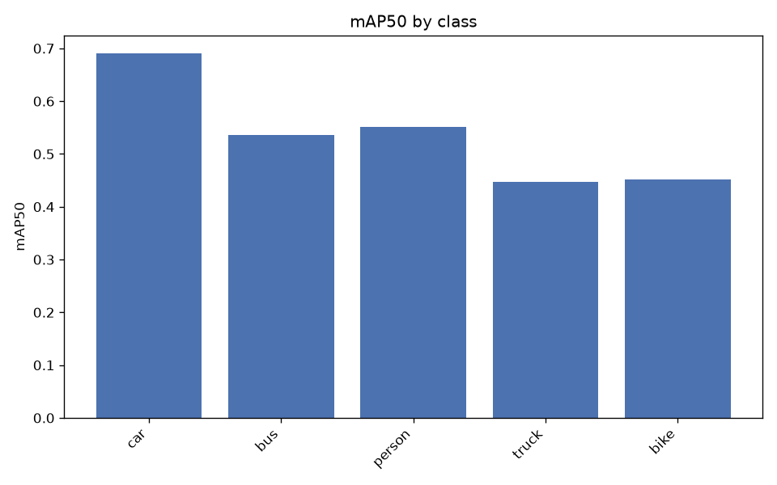
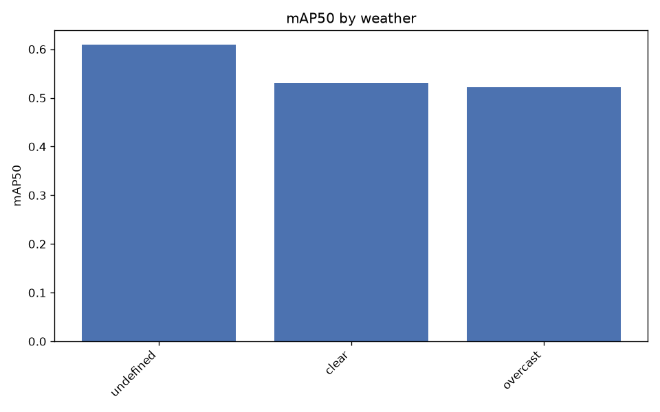
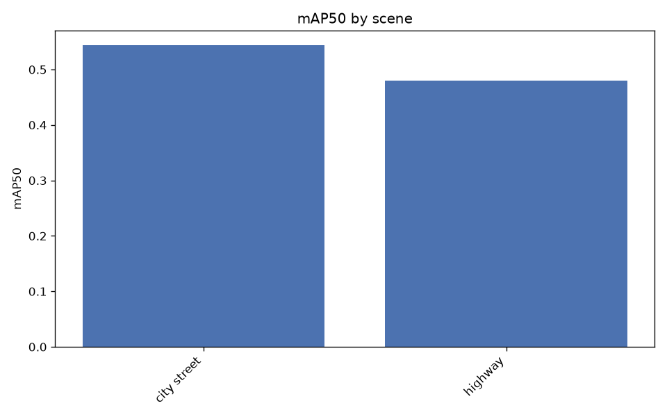
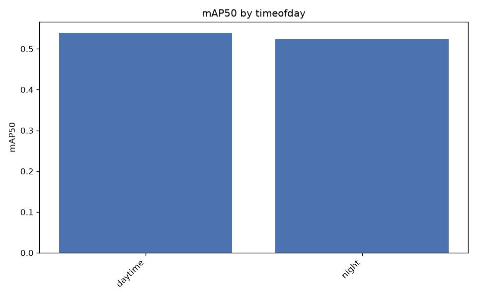
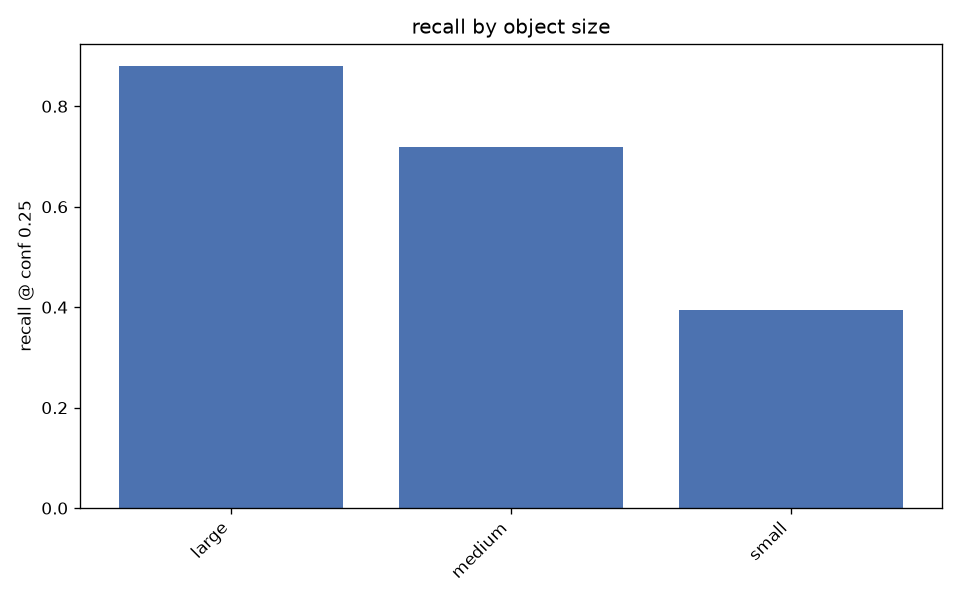

# Evaluation report

Experiment: `yolo11s_640_bdd5_2k` | imgsz 640 | val images 500
Slice metrics below the mAP tables are recall at conf 0.25, IoU 0.5.

## Overall

- mAP50: 0.5354
- mAP50-95: 0.3088
- precision: 0.6310
- recall: 0.4912

## Per class

| class   |   precision |   recall |   mAP50 |   mAP50-95 |
|:--------|------------:|---------:|--------:|-----------:|
| car     |      0.7415 |   0.6259 |  0.6904 |     0.4109 |
| bus     |      0.6347 |   0.4692 |  0.5362 |     0.3922 |
| person  |      0.6962 |   0.4623 |  0.5518 |     0.2532 |
| truck   |      0.5460 |   0.4316 |  0.4476 |     0.2910 |
| bike    |      0.5365 |   0.4670 |  0.4510 |     0.1968 |

## By weather

| weather   |   n_images |   precision |   recall |   mAP50 |   mAP50-95 |
|:----------|-----------:|------------:|---------:|--------:|-----------:|
| undefined |         75 |      0.7254 |   0.5211 |  0.6090 |     0.3673 |
| clear     |        227 |      0.6228 |   0.4967 |  0.5305 |     0.3039 |
| overcast  |         73 |      0.6539 |   0.4555 |  0.5220 |     0.3133 |

## By scene

| scene       |   n_images |   precision |   recall |   mAP50 |   mAP50-95 |
|:------------|-----------:|------------:|---------:|--------:|-----------:|
| city street |        363 |      0.6354 |   0.4946 |  0.5435 |     0.3162 |
| highway     |         93 |      0.6455 |   0.4661 |  0.4798 |     0.2738 |

## By timeofday

| timeofday   |   n_images |   precision |   recall |   mAP50 |   mAP50-95 |
|:------------|-----------:|------------:|---------:|--------:|-----------:|
| daytime     |        339 |      0.6296 |   0.5018 |  0.5397 |     0.3168 |
| night       |        115 |      0.5368 |   0.5032 |  0.5239 |     0.2743 |

## By object size

Buckets are COCO convention on box area: small <32^2, medium 32^2-96^2, large >96^2 px.

| class   | size   |   n_gt |   recall |
|:--------|:-------|-------:|---------:|
| ALL     | large  |   1275 |   0.8808 |
| ALL     | medium |   3313 |   0.7199 |
| ALL     | small  |   3398 |   0.3949 |
| car     | small  |   2328 |   0.4510 |
| car     | medium |   1939 |   0.8020 |
| car     | large  |    898 |   0.9532 |
| bus     | small  |     40 |   0.0500 |
| bus     | medium |     97 |   0.3814 |
| bus     | large  |    100 |   0.7100 |
| person  | small  |    864 |   0.3009 |
| person  | medium |    825 |   0.6788 |
| person  | large  |     71 |   0.8732 |
| truck   | small  |     94 |   0.1596 |
| truck   | medium |    219 |   0.4338 |
| truck   | large  |    162 |   0.6173 |
| bike    | small  |     72 |   0.2083 |
| bike    | medium |    233 |   0.5923 |
| bike    | large  |     44 |   0.7727 |

## By occlusion / truncation

| group     | class   |   n_gt |   recall |
|:----------|:--------|-------:|---------:|
| occluded  | bike    |    312 |   0.5353 |
| occluded  | bus     |    156 |   0.3333 |
| occluded  | car     |   3566 |   0.5788 |
| occluded  | person  |   1061 |   0.3996 |
| occluded  | truck   |    321 |   0.3676 |
| truncated | bike    |     26 |   0.5769 |
| truncated | bus     |     50 |   0.7200 |
| truncated | car     |    481 |   0.8150 |
| truncated | person  |     51 |   0.6863 |
| truncated | truck   |     67 |   0.5672 |
| visible   | bike    |     37 |   0.5405 |
| visible   | bus     |     81 |   0.7160 |
| visible   | car     |   1599 |   0.8737 |
| visible   | person  |    699 |   0.6552 |
| visible   | truck   |    154 |   0.5974 |
| whole     | bike    |    323 |   0.5325 |
| whole     | bus     |    187 |   0.3957 |
| whole     | car     |   4684 |   0.6552 |
| whole     | person  |   1709 |   0.4956 |
| whole     | truck   |    408 |   0.4216 |

## False positive types

| fp_type         |   count |
|:----------------|--------:|
| localization    |    1410 |
| duplicate       |     498 |
| background      |     450 |
| class_confusion |     319 |

Most common class confusions:

| gt     | predicted   |   count |
|:-------|:------------|--------:|
| truck  | car         |      85 |
| car    | truck       |      71 |
| bus    | truck       |      44 |
| truck  | bus         |      40 |
| bus    | car         |      38 |
| car    | bus         |      16 |
| bike   | person      |       8 |
| person | bike        |       5 |
| person | car         |       4 |
| bike   | car         |       4 |

## Worst images

| image                 |   n_gt |   fn |   fp |   errors | timeofday   | weather       |
|:----------------------|-------:|-----:|-----:|---------:|:------------|:--------------|
| b4065fc4-ede06556.jpg |     46 |   21 |   20 |       41 | daytime     | clear         |
| c9283177-1ac311e2.jpg |     28 |    9 |   27 |       36 | daytime     | overcast      |
| b2daf29d-6198754f.jpg |     47 |   30 |    5 |       35 | daytime     | overcast      |
| b4c733a8-46d78670.jpg |     41 |   24 |   11 |       35 | daytime     | partly cloudy |
| bc7a0adc-260a111d.jpg |     35 |   23 |   12 |       35 | daytime     | partly cloudy |
| c28cecbb-11796cf6.jpg |     39 |   25 |   10 |       35 | daytime     | overcast      |
| c59c31f2-cdac8cc8.jpg |     40 |   23 |   11 |       34 | daytime     | undefined     |
| be26ac57-35dabb9c.jpg |     41 |   20 |   13 |       33 | daytime     | undefined     |
| bb4935b0-e3fcded0.jpg |     27 |   13 |   18 |       31 | daytime     | overcast      |
| b6db6674-29fd8e88.jpg |     34 |   22 |    8 |       30 | daytime     | overcast      |
| b6f2176b-20c2f527.jpg |     25 |   16 |   12 |       28 | daytime     | clear         |
| b75da19e-78c2c800.jpg |     37 |   18 |   10 |       28 | daytime     | overcast      |

Overlays in `failures/` — green = correct, red = false positive, yellow = missed.

Curves and confusion matrix: `overall/`